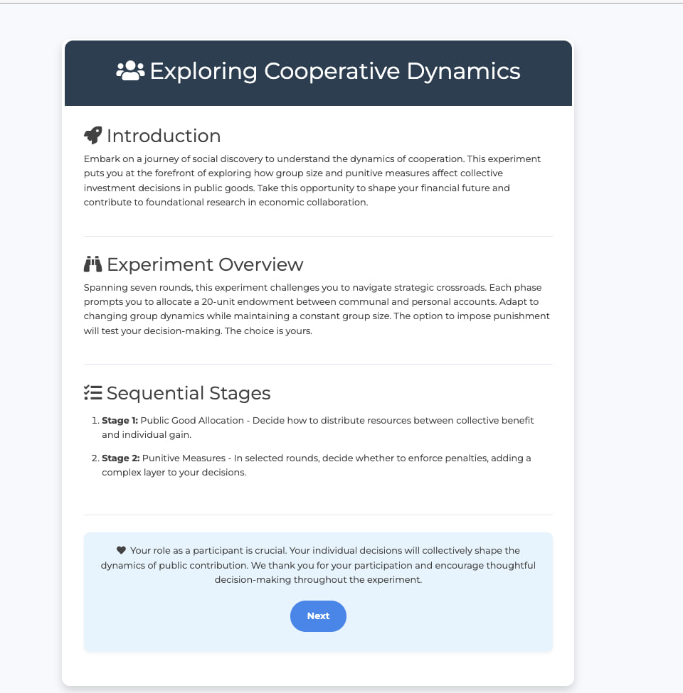
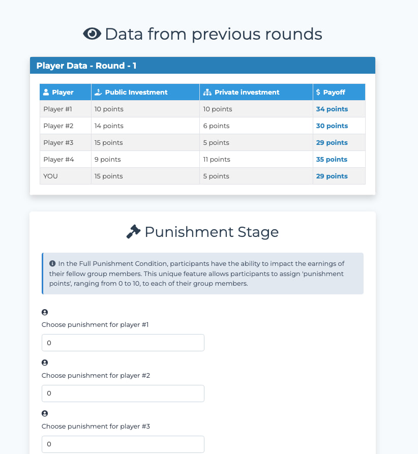
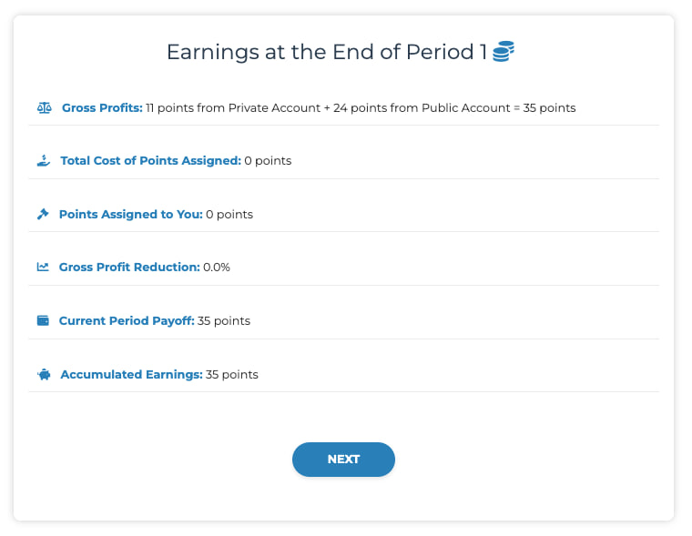
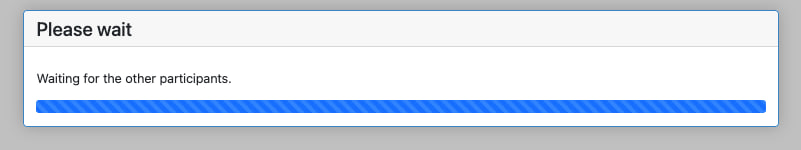

# Public Goods Game

This repository contains the implementation of a Public Goods Game using oTree. The game is designed to study the behavior of participants in a public goods scenario with and without punishment conditions.

## Screenshots

Here are some screenshots of the game in action:

### Screenshot 1

### Screenshot 2


### Screenshot 3


### Screenshot 4



## Project Structure

- `public_goods_game/`
  - `__init__.py`: Initialization file for the app.
  - `models.py`: Contains the models for the game, including `Constants`, `Subsession`, `Group`, and `Player`.
  - `pages.py`: Defines the pages of the game, including `IntroductionPage`, `Contribution`, `GroupWaitPage`, `FirstStageResults`, and `ObservationPage`.
  - `tests.py`: Contains tests for the game.
  - `_templates/`: Directory containing HTML templates for the game.
  - `settings.py`: Configuration settings for the game.
  - `requirements.txt`: Lists the dependencies required for the project.

## Game Description

The Public Goods Game is a standard economic experiment where participants decide how much of their endowment to contribute to a public pot. The total contributions are then multiplied by an efficiency factor and redistributed to all participants. This version of the game includes a punishment condition that can be toggled on or off.

### Key Features

- **Punishment Condition**: Groups can be assigned a punishment condition to study its effect on contributions.
- **Rounds**: The game consists of multiple rounds, with the ability to display recent rounds' data.
- **Endowment and Investment**: Participants decide how much of their endowment to invest in the public account.

## Installation

1. Clone the repository:
   ```bash
   git clone https://github.com/yourusername/public_goods_game.git
   ```
2. Navigate to the project directory:
   ```bash
   cd public_goods_game
   ```
3. Install the required dependencies:
   ```bash
   pip install -r requirements.txt
   ```

## Running the Game

1. Set the admin password in an environment variable:
   ```bash
   export OTREE_ADMIN_PASSWORD='your_password'
   ```
2. Run the oTree server:
   ```bash
   otree devserver
   ```
3. Open your web browser and go to `http://localhost:8000` to start the game.

## License

This project is licensed under the MIT License. See the [LICENSE](LICENSE) file for details.

## Acknowledgements

This project uses [oTree](https://www.otree.org/) for implementing the economic experiments.
